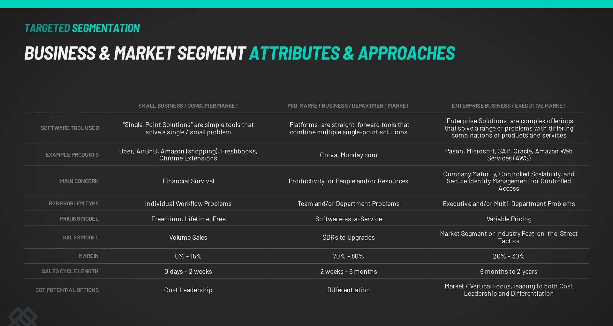
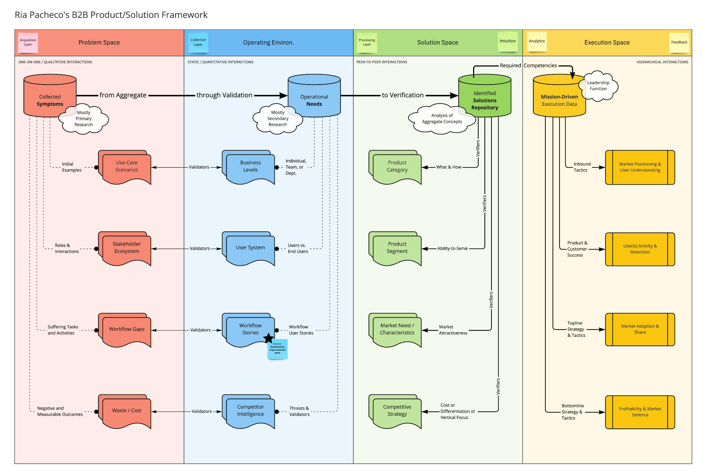

# Overview & Key Concepts

The Customer Discovery phase, from the PMM perspective, is where we understand the customer, the problems they face, and which problems make the most sense for us to target with our existing solution. We aim to _discover_, _understand_, and _validate_ customer problems, perceptions, and the true expectations that they operate under.&#x20;

## Understanding the Customer

During this phase, it's important for me to fully analyze the market and interact with customers, stakeholders, and domain experts, to gather as much data as possible. Activities that achieve this level of insight include (but are not limited to): market/competitor research, customer interviews/surveys, user analytics analysis, and customer workflow value chain mapping.

Here is a document, which I've been developing over the course of my career, that captures patterns found across three different market types:

## Examining "Discovery Spaces"

Since there are many moving parts, I borrow concepts from _systems engineering_ to more easily break down discovery into three major spaces:

1. The Problem Space
2. The Operating Space \[Environment]
3. The Solution Space

### Outcome Artifact: Target Customer Data

Ultimately, the goal of this phase is to ensure that enough insight has been gathered to know our customer inside and out. If done correctly, one could develop a customer data repo like this:

