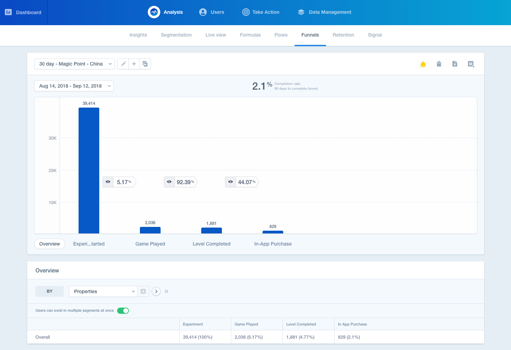

# 📊 User Tracking

Exploring user behaviors through tracking tools like Mixpanel allow for insights that can't be discovered from explicit conversations in interviews. From a PMM perspective, it uncovers opportunities to creatively use existing features for different use-cases and produce narratives that speak to the users' true workflow.&#x20;

This method, of gathering user data, is broad enough for Product Marketing, Product Management, Sales, _and_ Customer Success to gain from.

### Insights and Artifacts

At minimum, Problem Space User Tracking Activities should produce:

* A list of events and the potential insights that a spike in any one of them might infer
* A review schedule between PMM, PM, CS, Sales, and executive teams to discuss user behaviors and what they might mean for each department's mission
* A list of alternative tools, outlining similar UX walk-throughs, which can be compared later

#### Sample

[Click here](https://ik.imagekit.io/fuc9k9ckt2b/Work\_Samples/MixpanelInsightPlanning\_Showpass\_l8uqRtkVP.pdf?ik-sdk-version=javascript-1.4.3\&updatedAt=1657155310547) to download a sample of a planning document used for Mixpanel implementation.
