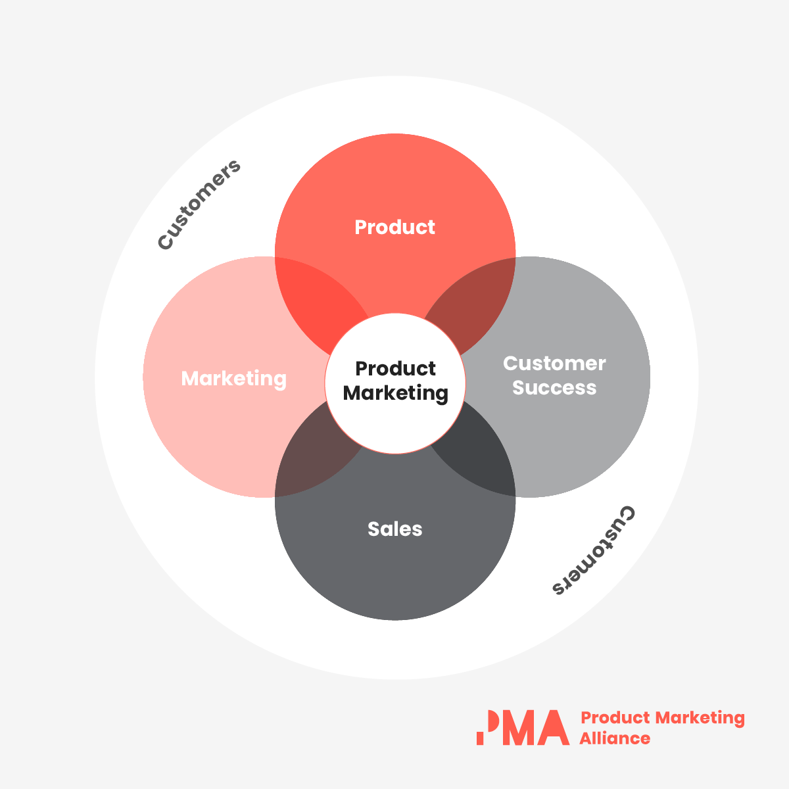

# General Overview

## What is Product Marketing Management?

Google _Product Marketing_ and you'll find the same Venn diagram outlining 4 key _functional_ areas: Marketing, Product, Customer Success, and Sales.

This is helpful in understanding the general breadth of the role, but these functional areas differ by quite a bit, which makes it hard to imagine exactly where they _should_ overlap to best describe Product Marketing. It can get especially confusing since the software, hardware, and service products we offer differ widely, with no single workflow, expectation, or level of tool complexity considered a consistent signal for benchmarking.

### The Job: Knowing the Customer's Voice

Ultimately, the PMM's job is to know the customer inside-and-out. They represent the customer's _voice_ and perspective. This understanding outlines the different problems customers face, which solutions they're using (or evaluating), and how to _communicate_ these solutions to a market for enabling **organic user adoption**, **outbound/inbound sales**, and **increased customer lifetime value**.

### The Result: Getting the Market's Wallet

What's often left out of public PMM descriptions are the activities that, when considered at face value, might look more like traditional marketing tactics than anything else. These activities make up the **Go-to-Market Strategy**. What differentiates this from traditional marketing is its focus in boosting sales while _also_ boosting user adoption and the discovery of other viral coefficients.

