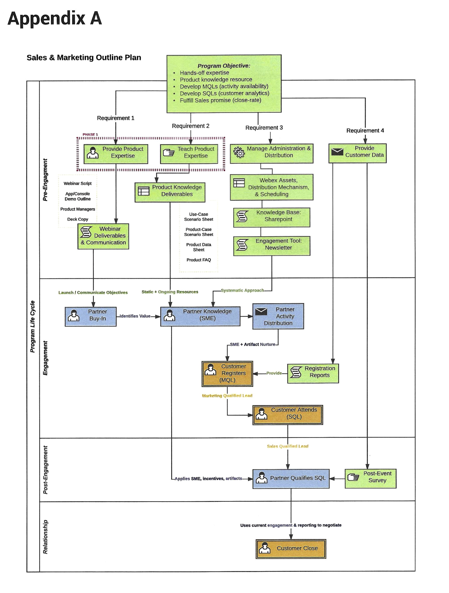

# Campaign/Program Fit

With a deep understanding of our market and our customers' expectations, we may identify core requirements for campaign success. This differs from product to product and depends on the structure of the sales organization.

### Results-Driven Planning: A Real-Life Example

As an example, here is a mapped outline for a product marketing & sales enablement plan I created, focused on 5 core program objectives:

1. Provide hands-off expertise for our distribution partners
2. Provide deep technical product knowledge, when required, as a resource for our partners to not only request but utilize in the form of customer-friendly technical town halls
3. Marketing Qualified Lead (MQL) development
4. Sales Qualified Lead (SQL) development
5. Fulfilled sales promise (close-rate)

