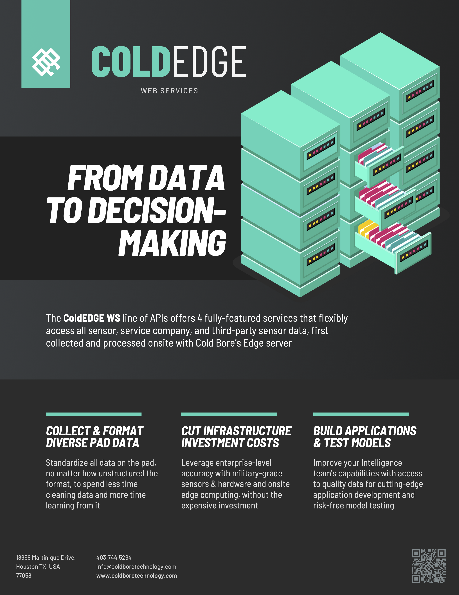

# Overview & Key Concepts

## Reusable Value

Once all Product Marketing content has been mapped and effectively stored in a way that enables the easy extraction of value, we can now formalize our content with materials fit for each identified vertical.

### Messaging Tailored for 2 Different Markets

As an example, here is a data sheet developed for the _**Completions**_ industry











Here is a second data sheet, utilizing some of the same value drivers (but with adjusted copy) for data-focused enterprise organizations:










